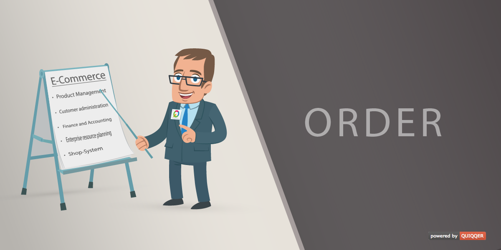

QUIQQER Order (ERP module)
========

The QUIQQER Order Module integrates complete order management in QUIQQER.

Paketname:

    quiqqer/order

Features (Funktionen)
--------

- Order system
    - Manager Orders
    - Provides an order process for the frontend
    - Integrates the Payment API to the Order Process
    - Integrates the Invoice Module
    - Automatic creation of invoices by orders
    - It is possible to create orders by hand in the administration.

- Basket (Shopping cart)
    - The shopping cart allows the user to place orders
    - There exists a basket and order overview in the administration

Installation
------------

The Package name is: quiqqer/order

Contribution
----------

- Issue Tracker: https://dev.quiqqer.com/quiqqer/order/issues
- Source Code: https://dev.quiqqer.com/quiqqer/order

Support
-------

If you have found an error or want improvements, please send an e-mail to support@pcsg.de.

Licence
-------

- GPL-3.0+
- PCSG QEL-1.0

Developers
--------

- onQuiqqerOrderSuccessful [Order]
- onQuiqqerOrderCreated [Order]
- onQuiqqerOrderDeleteBegin [Order]
- onQuiqqerOrderDelete [$orderId, $orderData]
- onQuiqqerOrderCopyBegin [Order]
- onQuiqqerOrderCopy [Order]
- onQuiqqerOrderUpdateBegin [Order]
- onQuiqqerOrderUpdate [Order]
- quiqqerOrderOrderProcessCheckoutOutput [AbstractOrderingStep, &text]
- onQuiqqerOrderPaidStatusChanged [Order, currentPaidStatus, previousPaidStatus]
- onQuiqqerOrderProcessStatusChange [Order, QUI\ERP\Order\ProcessingStatus\Status]
- quiqqerOrderCustomerDataSave [QUI\ERP\Order\Controls\OrderProcess\CustomerData]
- quiqqerOrderCustomerDataSaveEnd [QUI\ERP\Order\Controls\OrderProcess\CustomerData]
- quiqqerOrderBasketRemovePos [QUI\ERP\Order\Basket\Basket, pos]
- quiqqerOrderBasketToOrder [QUI\ERP\Order\Basket\BasketOrder, $Order, QUI\ERP\Products\Product\ProductList]
- onQuiqqerOrderProcessSendBegin [QUI\ERP\Order\OrderProcess]
- onQuiqqerOrderProcessSendCreateOrder [QUI\ERP\Order\OrderProcess]
- onQuiqqerOrderProcessSend [QUI\ERP\Order\OrderProcess]
- onQuiqqerOrderCustomerChange [Order]
- onQuiqqerOrderCustomerCustomerSet [Order]
- onQuiqqerBasketImport [Basket Instance, ProductList]

### Order Events

- onOrderStart [\QUI\ERP\Order\OrderProcess]
- onOrderSuccess [Order]
- onOrderAbort [Order]

### Template Events

- onQuiqqer::order::orderProcessBasketBegin [Collector, Basket]
- onQuiqqer::order::orderProcessBasketEnd [Collector, Basket]
- onQuiqqer::order::orderProcessCustomerDataBegin [Collector, User, Address]
- onQuiqqer::order::orderProcessCustomerData [Collector, User, Address]
- onQuiqqer::order::orderProcessCustomerEnd [Collector, User, Address]
- onQuiqqer::order::orderProcessCheckoutBegin [Collector, User, Order]
- onQuiqqer::order::orderProcessCheckoutEnd [Collector, User, Order]
- onQuiqqer::order::orderProcessFinish [Collector, User, Order]
